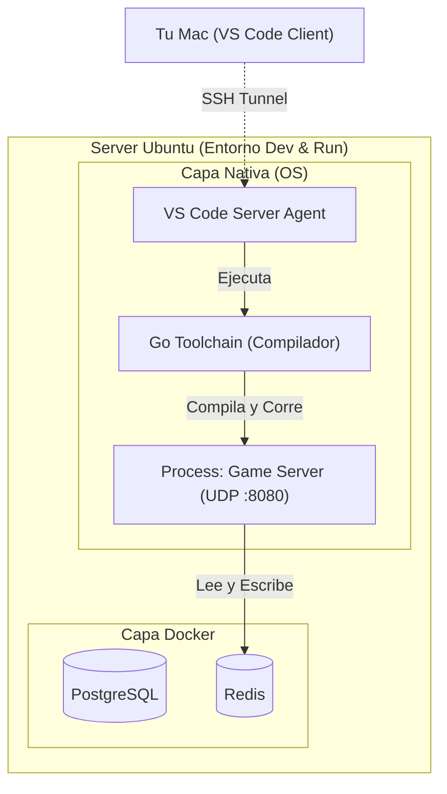
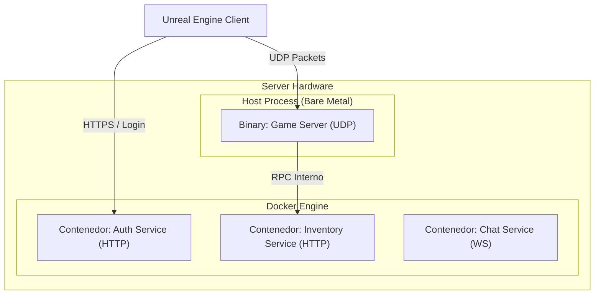

# Fase 0: Fundaciones

## Especificación Técnica del Game Server

Este documento detalla la implementación técnica requerida para el hito inicial del proyecto MMO. El objetivo principal es establecer una comunicación bidireccional de baja latencia entre el cliente (Unreal Engine) y el servidor (Go).

---

## 1. Objetivos de la Fase

- **Apertura del Socket UDP**: Configurar un listener en el servidor que escuche por el puerto 8080
- **Tick Loop Autoritativo**: Implementar un bucle de simulación constante a 30Hz (intervalos de 33.3ms)
- **Handshake Inicial**: Proceso de conexión donde el cliente se identifica y el servidor lo registra en la memoria volátil
- **Eco de Movimiento**: El cliente envía su posición deseada; el servidor la valida con lógica básica y la replica a todos los demás clientes conectados

---

## 2. Stack Tecnológico (Alcance Fase 0)

| Componente       | Tecnología                                                                                          |
|------------------|-----------------------------------------------------------------------------------------------------|
| **Lenguaje**     | Go 1.21 o superior                                                                                  |
| **Protocolo**    | UDP (Raw) o `kcp-go` para añadir confiabilidad sobre UDP sin sacrificar latencia                    |
| **Estado**       | Almacenado íntegramente en memoria usando `map` de Go protegidos por `sync.RWMutex`                |
| **Logs**         | Salida estándar (stdout) con niveles de severidad (`INFO`, `WARN`, `ERROR`)                        |

---

## 3. Estructura de Paquetes (Byte Stream)

Para optimizar la latencia y minimizar el uso de ancho de banda, se utilizará una estructura binaria fija en lugar de JSON:

| Campo      | Tipo     | Tamaño     | Descripción                                                                    |
|------------|----------|------------|--------------------------------------------------------------------------------|
| `Type`     | `uint8`  | 1 byte     | Tipo de mensaje (`0`: Handshake, `1`: Move, `2`: Heartbeat)                   |
| `Sequence` | `uint32` | 4 bytes    | ID incremental para descartar paquetes obsoletos o fuera de orden             |
| `PlayerID` | `uint64` | 8 bytes    | Identificador único del jugador (asignado tras el Handshake)                  |
| `Payload`  | var      | Variable   | Datos específicos según el tipo (ej. Floats para X, Y, Z, Yaw)                |

---

## 4. El "Hot Path" (Lógica del Servidor)

El agente debe implementar un bucle principal (Main Loop) que siga esta lógica secuencial:

```go
// Pseudocódigo del Tick Loop
for {
    start := time.Now()
    
    // 1. Procesar Input Buffer
    // Leer todos los comandos recibidos desde el último tick.
    processInputs()
    
    // 2. Actualizar Estado del Mundo
    // Aplicar lógica de movimiento y validaciones simples.
    updateWorldState()
    
    // 3. Broadcast de Snapshots
    // Enviar el nuevo estado a todos los clientes conectados.
    broadcastState()
    
    // 4. Control de Frecuencia
    // Dormir el proceso el tiempo restante para cumplir los 33ms.
    sleepUntilNextTick(start)
}
```

---

## 5. Integración con Unreal Engine (Cliente)

- **Comunicación**: El cliente debe utilizar la clase `FUdpSocketBuilder` para gestionar el socket
- **Sincronización**: El cliente debe enviar sus actualizaciones de posición a la misma frecuencia que el servidor (30Hz)
- **Interpolación**: Se requiere que el cliente implemente interpolación lineal (Lerp) para las posiciones recibidas del servidor para suavizar el movimiento visual

---

## 6. Criterios de Aceptación

✅ **Conectividad**: El servidor debe ser capaz de registrar la conexión de un cliente y asignarle un `EntityID` único

✅ **Eficiencia**: El uso de CPU en el servidor no debe exceder el 1% de un núcleo físico para una carga de 10 clientes simultáneos

✅ **Fluidez**: La latencia percibida entre que el Cliente A se mueve y el Cliente B lo visualiza debe ser menor a 100ms en condiciones de red local

---


---

## 7. Arquitectura de Despliegue Híbrida (Diagramas)

Para aclarar la estrategia de infraestructura, utilizaremos un enfoque híbrido.

### ¿Por qué Go en el Servidor (Bare Metal)?
1.  **Entorno de Desarrollo Remoto**: Al usar `VS Code Remote SSH`, el servidor Ubuntu actúa como tu estación de trabajo. Necesitas el compilador (`go`) instalado localmente para que VS Code pueda ofrecer intellisense, detección de errores y depuración.
2.  **Performance (Simulación)**: El Game Server es sensible a microsegundos. Evitar la capa de abstracción de red de Docker (NAT/Bridge) en esta fase inicial simplifica el debugging del protocolo UDP.

### Diagrama de Despliegue: Fase 0 (Actual)



### Diagrama de Despliegue: Fase Final (Producción)

A futuro, los microservicios web (Auth, Inventario) vivirán en contenedores, mientras el Game Server mantiene privilegios de red directos.




---

> [!CAUTION]
> En esta fase queda estrictamente prohibida la implementación de persistencia en disco o bases de datos. Todo el estado debe ser volátil para priorizar la velocidad del desarrollo del protocolo de red.