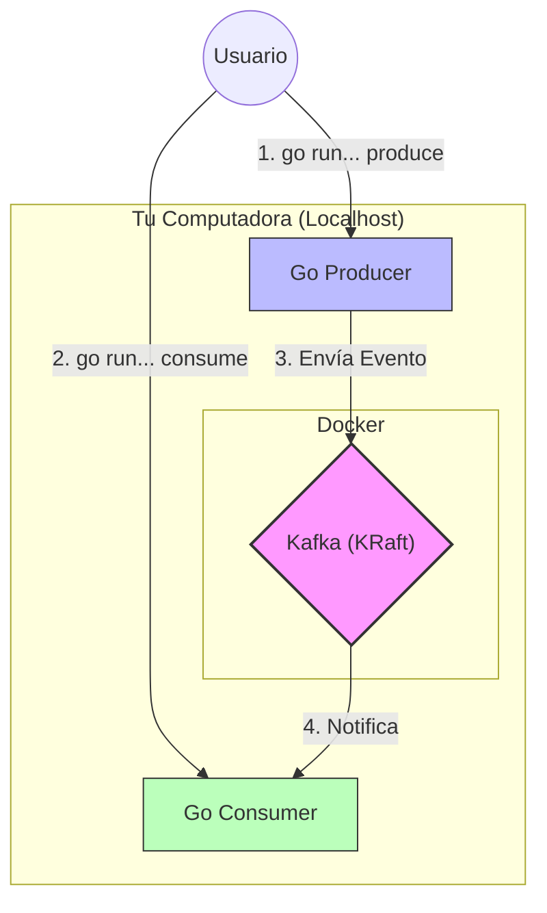
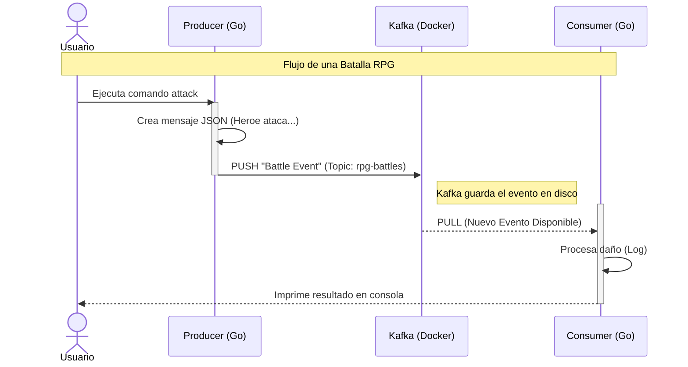

# Unidad 2: Conceptos Teóricos - Kafka y Go

Antes de escribir código, entendamos las herramientas. Vamos a explicar esto "para Juniors, diseñado por Seniors".

## 🧠 Kafka: No es una base de datos, es un tronco (Log)
Imagina Kafka no como una caja donde guardas cosas (database), sino como una **cinta transportadora** infinita o una tubería.

### Conceptos Clave
1.  **Eventos**: Son mensajes. Algo que pasó. Ej: `{ "tipo": "DAÑO", "valor": 50, "target": "Orco" }`.
2.  **Topics (Tópicos)**: Son las etiquetas de la tubería. Un topic podría ser `world-events`. Todos los eventos del mundo van ahí.
3.  **Producer (Productor)**: El que grita el mensaje. "¡He golpeado al orco!".
4.  **Consumer (Consumidor)**: El que escucha. "Oh, alguien golpeó al orco, le bajaré la vida".

> **Analogía**: Twitter (X).
> - **Producer**: Tú escribiendo un tweet.
> - **Topic**: El hashtag #RPG.
> - **Consumer**: Alguien siguiendo ese hashtag.

## 🐹 Go: Concurrencia Nativa
Go es perfecto para esto porque maneja "hacer muchas cosas a la vez" de forma nativa.

- **Goroutines**: Son como hilos (threads) pero ultra ligeros. Podemos tener miles de "trabajadores" escuchando eventos sin que la computadora sude.
- **Channels**: Son tuberías internas de Go.

### ¿Cómo se unen?
Nuestra arquitectura será así:

1.  Un microservicio (Producer) recibe una acción (o comando CLI).
2.  Envía el evento a Kafka.
3.  Otro microservicio (Consumer) ve el evento en Kafka y reacciona.

### Flujo de Mensajes (Sequence Diagram)

---

## 📘 Diccionario Go para Node.js Developers
Si vienes de Javascript, esto te servirá para traducir conceptos mentales:

| Concepto | En Node.js (JS) | En Go | Explicación |
| :--- | :--- | :--- | :--- |
| **Dependencias** | `package.json` | `go.mod` | Define el nombre del módulo y qué librerías usa. |
| **Lockfile** | `package-lock.json` | `go.sum` | Checksums criptográficos para asegurar que nadie modificó las librerías. |
| **Limpieza** | `try...finally` | `defer` | Ejecuta código (como cerrar conexiones) al final de la función, pase lo que pase. |
| **Async** | `Promise` / `async-await` | Bloqueante (síncrono) | En Go el código *parece* síncrono. La concurrencia se maneja "por fuera" con Goroutines. |
| **Control** | `AbortController` | `context.Context` | Permite cancelar operaciones largas, poner timeouts y pasar metadata entre funciones. |

> **Nota sobre `go.mod`**: A diferencia de `node_modules` que pesa gigas y está en tu proyecto, Go guarda las librerías compiladas en una caché global en tu sistema (`$GOPATH`). Tu proyecto se mantiene ligero.

---

## 🧠 Kafka Deep Dive: Lo que pasa "bajo el capó"

### 1. ¿Por qué usamos `Key` en los mensajes?
Habrás notado que enviamos `Key: "Key-1"`. ¿Por qué no solo el valor?

Kafka garantiza orden **solo dentro de una partición**.
*   Si envías 10 mensajes sin Key, Kafka los reparte aleatoriamente (Round Robin) entre las particiones disponibles.
*   Si envías mensajes con la misma Key (ej: `userID: 123`), Kafka asegura que **todos** vayan a la misma partición.
*   **Resultado**: Aseguramos que los eventos de un mismo usuario se procesen en el orden correcto (no queremos procesar "Murió" antes que "Recibió Daño").

### 2. Brokers vs Controllers (En nuestro Docker)
En el `docker-compose.yml` verás configuraciones como `KRaft`.
*   **Broker**: Es el servidor que almacena los datos (el disco duro inteligente).
*   **Controller**: Es el "jefe". Decide en qué broker se guarda cada copia de los datos.
*   **KRaft**: Antiguamente Kafka necesitaba otro software llamado *Zookeeper* para elegir al jefe. Ahora Kafka es lo suficientemente listo para votarse a sí mismo (Raft Consensus), simplificando nuestra infraestructura.

---
**🚀 Siguiente Paso**: Vamos a implementar nuestro primer Productor y Consumidor en Go para ver esto en acción.
