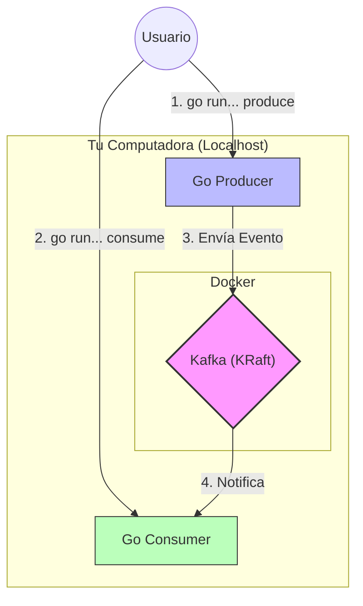
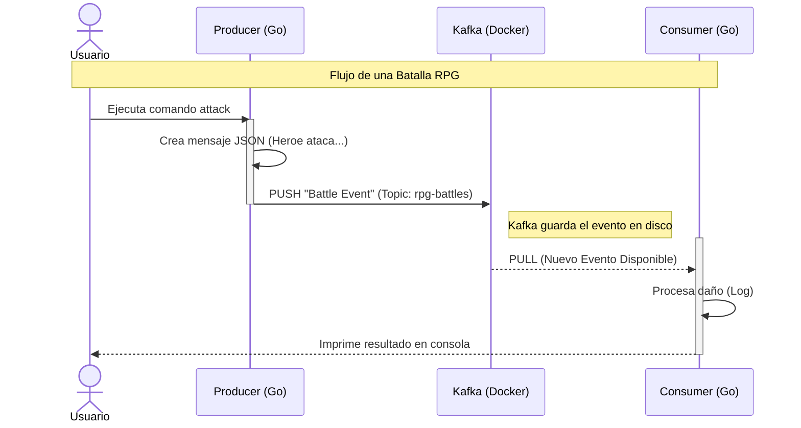

# Unidad 2: Conceptos Teóricos - Kafka y Go

Antes de escribir código, entendamos las herramientas. Vamos a explicar esto "para Juniors, diseñado por Seniors".

## 🧠 Kafka: No es una base de datos, es un tronco (Log)
Imagina Kafka no como una caja donde guardas cosas (database), sino como una **cinta transportadora** infinita o una tubería.

### Conceptos Clave
1.  **Eventos**: Son mensajes. Algo que pasó. Ej: `{ "tipo": "DAÑO", "valor": 50, "target": "Orco" }`.
2.  **Topics (Tópicos)**: Son las etiquetas de la tubería. Un topic podría ser `world-events`. Todos los eventos del mundo van ahí.
3.  **Producer (Productor)**: El que grita el mensaje. "¡He golpeado al orco!".
4.  **Consumer (Consumidor)**: El que escucha. "Oh, alguien golpeó al orco, le bajaré la vida".

> **Analogía**: Twitter (X).
> - **Producer**: Tú escribiendo un tweet.
> - **Topic**: El hashtag #RPG.
> - **Consumer**: Alguien siguiendo ese hashtag.

## 🐹 Go: Concurrencia Nativa
Go es perfecto para esto porque maneja "hacer muchas cosas a la vez" de forma nativa.

- **Goroutines**: Son como hilos (threads) pero ultra ligeros. Podemos tener miles de "trabajadores" escuchando eventos sin que la computadora sude.
- **Channels**: Son tuberías internas de Go.

### ¿Cómo se unen?
Nuestra arquitectura será así:

1.  Un microservicio (Producer) recibe una acción (o comando CLI).
2.  Envía el evento a Kafka.
3.  Otro microservicio (Consumer) ve el evento en Kafka y reacciona.

### Flujo de Mensajes (Sequence Diagram)

---
**🚀 Siguiente Paso**: Vamos a implementar nuestro primer Productor y Consumidor en Go para ver esto en acción.
