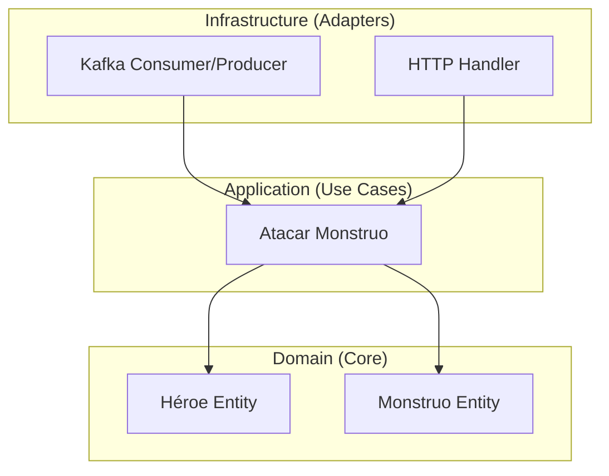

# Unidad 3: Estructura de Microservicios en Go

Bienvenido a las "ligas mayores". Hasta ahora escribimos todo en un `main.go`, pero eso no escala cuando tienes 50 endpoints y lógica de negocio compleja.

En esta unidad, adoptaremos el **Standard Go Project Layout** y principios de **Arquitectura Hexagonal** (Ports & Adapters).

## 🏗️ La Arquitectura

Queremos separar lo que nuestro software *es* (Lógica de Dominio) de lo que nuestro software *usa* (Kafka, HTTP, Bases de Datos).

## 📂 Estructura de Carpetas

Esto es lo que acabamos de crear en `projects/section-03-structure`:

-   **`cmd/`**: Puntos de entrada. Aquí vive el `main`. No hay lógica de negocio, solo "enciende" cosas.
    -   `cmd/hero-service/main.go`: Nuestro ejecutable.
-   **`internal/`**: Código privado de nuestra aplicación (nadie más puede importarlo).
    -   **`domain/`**: El corazón. Entidades (Héroe, Monstruo) y reglas puras. Cero librerías externas.
    -   **`application/`**: Casos de uso. Orquesta el dominio. Ej: "Recibir daño", "Subir de nivel".
    -   **`infrastructure/`**: Implementación técnica. Aquí vive el código de Kafka, Bases de Datos, etc.
-   **`pkg/`**: Código público que podría ser útil para otros microservicios (librerías compartidas).

---
**💎 Regla de Oro**: Las dependencias apuntan hacia ADENTRO.
- `infrastructure` conoce a `domain`.
- `domain` NO conoce a `infrastructure`. (Un Héroe no sabe qué es Kafka).
