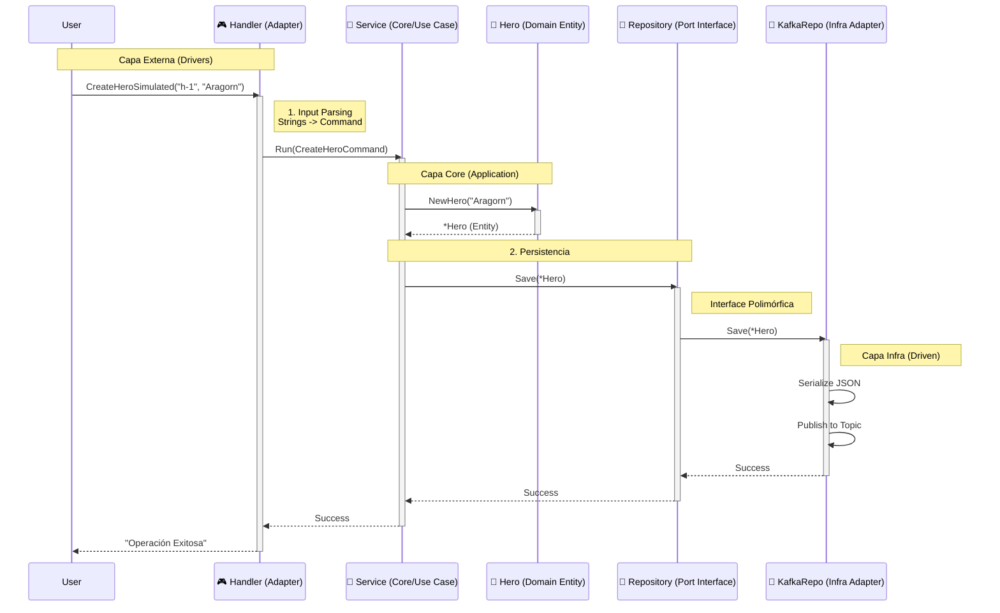

# 04 - Arquitectura Profunda: Handlers, Commands y DTOs

En esta sección aclaramos dudas cruciales sobre el diseño arquitectónico que hemos implementado.

## 1. El Flujo de Control (Sequence Diagram)

Aquí tienes el diagrama exacto de cómo viaja la petición "Crear Héroe" a través de nuestras capas refactorizadas.

## 2. Handler vs Service: ¿Quién hace qué?

Es común confundirse porque a veces se ven similares. La diferencia es la **Responsabilidad**.

### 🎮 Handler (Driving Adapter)
*   **Entorno:** Vive en la "rontera" de tu aplicación (`internal/handlers`).
*   **Lenguaje:** Habla el idioma del protocolo externo (HTTP Status Codes, JSON Bodies, CLI Flags, AWS Lambda Events).
*   **Misión:**
    1.  Validar el formato de entrada (¿Es un JSON válido? ¿Es un string?).
    2.  Transformar el Input sucio a un **Command** de dominio limpío.
    3.  Llamar al Servicio.
    4.  Traducir la respuesta del Servicio al protocolo externo (ej: `return 201 Created`).
*   **Ejemplo:** `CLIHandler`, `HTTPHandler`, `GRPCHandler`.

### 🧠 Service (Application Core)
*   **Entorno:** Vive en el centro purificado (`internal/core/services`).
*   **Lenguaje:** Habla SOLO el idioma del negocio (Entidades, Reglas, Errores de Negocio).
*   **Misión:** Orquestar el caso de uso. "Primero valido el héroe, luego lo guardo, luego notifico".
*   **Independencia:** No sabe si fue invocado por HTTP o por Consola.

---

## 3. Command vs DTO: La Guerra de Nombres

Preguntaste: *"¿Por qué `CreateHeroCommand` y no `CreateHeroDTO`?"*

### DTO (Data Transfer Object)
*   **Qué es:** Una caja tonta para mover datos.
*   **Dónde vive habitualmente:** En los bordes (Adapters). Ejemplo: `HeroResponseDTO` (lo que mandas al frontend).
*   **Intención:** "Aquí hay datos".

### Command (CQS Pattern)
*   **Qué es:** Un objeto que representa una **INTENCIÓN IMPERATIVA** del usuario.
*   **Dónde vive:** En la capa de Aplicación/Core.
*   **Intención:** "¡QUIERO QUE HAGAS ALGO!" (Imperativo).
*   **Semántica:** `CreateHeroCommand` dice explícitamente "Voy a modificar el estado del sistema".

**¿Por qué usamos Command?**
En **CQRS (Command Query Responsibility Segregation)**, distinguimos tajantemente entre:
1.  **Commands**: Escriben datos (Create/Update/Delete).
2.  **Queries**: Leen datos (Get/List).

Al llamar al struct `CreateHeroCommand`, estamos comunicando que esto es una operación de **Escritura** que impactará el negocio. Un `DTO` es genérico; un `Command` es específico y poderoso.
