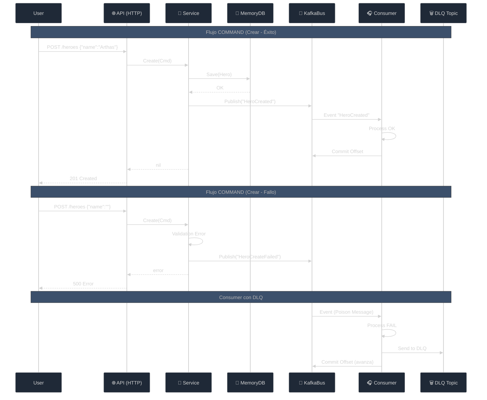

# 05 - Ciclo Completo y Patrones SOLID

Hemos llegado al final de nuestra implementación "Core".
En esta sección conectamos **todos** los puntos y aplicamos el patrón **CQS (Command Query Separation)** con **CRUD completo**.

## 1. El Ciclo de Vida (Full CRUD + Event-Driven)

Nuestro sistema ahora soporta **CRUD completo** con arquitectura event-driven:
1.  **Create**: `POST /heroes` → Crea, Persiste y Notifica (`HeroCreated` o `HeroCreateFailed`)
2.  **Read**: `GET /heroes?id=...` → Consulta un héroe específico
3.  **Update**: `PUT /heroes?id=...` → Actualiza y Notifica (`HeroUpdated` o `HeroUpdateFailed`)
4.  **Delete**: `DELETE /heroes?id=...` → Elimina y Notifica (`HeroDeleted` o `HeroDeleteFailed`)
5.  **List**: `GET /heroes` → Lista todos los héroes

### Eventos Publicados en Kafka

**Todos** los eventos se publican en `hero-events-05` con estructura estándar:
```json
{
  "event_type": "HeroCreated",
  "occurred_at": "2025-12-18T16:00:00Z",
  "data": {
    "id": "h-100",
    "name": "Arthas",
    "level": 1,
    "power": 10,
    "created_at": "2025-12-18T16:00:00Z"
  }
}
```

**Tipos de Eventos:**
- ✅ **Éxito**: `HeroCreated`, `HeroUpdated`, `HeroDeleted`
- ❌ **Fallo**: `HeroCreateFailed`, `HeroUpdateFailed`, `HeroDeleteFailed`



## 2. Refactorización y Estructura

Para mantener el código limpio y profesional, hemos dividido el Servicio (`herosrv`) en archivos según su responsabilidad (Vertical Slicing dentro del componente):

-   `service.go`: Definición de Dependencias (`struct`) y Factory (`New`).
-   `create.go`: Lógica de Escritura (**Command**).
-   `get.go`: Lógica de Lectura (**Query**).
-   `update.go`: Lógica de Actualización (**Command**).
-   `delete.go`: Lógica de Eliminación (**Command**).
-   `list.go`: Lógica de Listado (**Query**).

## 3. SOLID aplicado al Microservicio

Durante todo el tutorial hemos aplicado patrones SOLID casi sin darnos cuenta. Aquí están explicados en nuestro código:

| Letra | Principio | Dónde se aplica | Explicación |
| :--- | :--- | :--- | :--- |
| **S** | **SRP** (Responsabilidad Única) | `create.go` vs `get.go` vs `update.go` | Hemos separado cada operación CRUD en archivos distintos. Cada archivo tiene una única razón para cambiar. |
| **O** | **OCP** (Abierto/Cerrado) | `EventBus` | Agregamos Kafka SIN tocar el Dominio. Podríamos agregar RabbitMQ haciendo otra implementación sin romper el `Service`. |
| **L** | **LSP** (Sustitución de Liskov) | `MemoryRepo` | `MemoryRepo` cumple con `ports.HeroRepository` igual que lo haría un `PostgresRepo`. El Servicio no sabe la diferencia. |
| **I** | **ISP** (Segregación de Interfaces) | `HeroRepository` vs `EventBus` | Separamos las interfaces de persistencia y eventos. Un servicio no necesita implementar ambas. |
| **D** | **DIP** (Inversión de Dependencias) | `Service` depende de `ports` | El core depende de abstracciones (interfaces), no de implementaciones concretas (Kafka, Memory). |

### Integración con Plataforma (Infraestructura)

Este microservicio es "Cloud Agnostic" pero depende de que exista una infraestructura de mensajería.
Usaremos **Platform Kafka Admin** para proveer esa infra.

1.  **Levantar Plataforma** (si no está corriendo):
    ```bash
    cd projects/platform-kafka-admin
    make initAll
    ```

2.  **Provisionar Recursos (Topics)**:
    ```bash
    # Topic principal
    curl -X POST -d '{"name":"hero-events-05"}' http://localhost:3000/topics
    
    # Topic DLQ (Dead Letter Queue)
    curl -X POST -d '{"name":"hero-events-05-dlq"}' http://localhost:3000/topics
    ```

3.  **Ejecutar Servicio**:
    ```bash
    cd projects/section-05-full-cycle
    make run-api
    ```

4.  **Ejecutar Consumer** (en otra terminal):
    ```bash
    make run-consumer
    ```

### 🧪 Probando el Sistema Completo

#### **1. Crear un Héroe (CREATE)**
```bash
curl -X POST -d '{"name":"Arthas"}' http://localhost:8081/heroes
```
- Respuesta:
```json
{
  "status": "created",
  "time": "2.3ms",
  "hero": {
    "id": "a1b2c3d4-e5f6-7890-abcd-ef1234567890",
    "name": "Arthas",
    "level": 1,
    "power": 10,
    "created_at": "2025-12-18T16:00:00Z"
  }
}
```
- Consumer log: `📨 CONSUMER: event_type=HeroCreated`
- **Nota**: El ID se genera automáticamente usando UUID v4

#### **2. Listar Héroes (LIST)**
```bash
curl http://localhost:8081/heroes
```
- Respuesta: `[{"id":"h-100","name":"Arthas",...}]`

#### **3. Consultar un Héroe (READ)**
```bash
curl "http://localhost:8081/heroes?id=h-100"
```
- Respuesta: `{"id":"h-100","name":"Arthas",...}`

#### **4. Actualizar un Héroe (UPDATE)**
```bash
curl -X PUT -d '{"name":"Arthas Menethil"}' "http://localhost:8081/heroes?id=h-100"
```
- Respuesta: `{"status":"updated"}`
- Consumer log: `📨 CONSUMER: event_type=HeroUpdated`

#### **5. Eliminar un Héroe (DELETE)**
```bash
curl -X DELETE "http://localhost:8081/heroes?id=h-100"
```
- Respuesta: `{"status":"deleted"}`
- Consumer log: `📨 CONSUMER: event_type=HeroDeleted`

#### **6. Probar Evento de Fallo**
```bash
curl -X POST -d '{"name":""}' http://localhost:8081/heroes
```
- Respuesta: `error creando hero: hero name cannot be empty`
- Consumer log: `📨 CONSUMER: event_type=HeroCreateFailed`

#### **7. Verificar DLQ** (Dead Letter Queue)
```bash
# Enviar mensaje venenoso directamente a Kafka
docker exec -i kafka /opt/kafka/bin/kafka-console-producer.sh \
  --bootstrap-server localhost:9092 \
  --topic hero-events-05 << EOF
{"fail":true}
EOF

# El consumer lo enviará al DLQ y seguirá procesando
```

## 4. Conclusión

Has construido un sistema:
1.  **CRUD Completo**: Create, Read, Update, Delete, List.
2.  **Event-Driven**: Todos los eventos (éxito y fallo) se publican en Kafka.
3.  **Resiliente**: DLQ para mensajes venenosos, el consumer nunca se bloquea.
4.  **Desacoplado**: Cambiar Kafka por RabbitMQ es trivial.
5.  **Testable**: Puedes mockear `ports.HeroRepository`.
6.  **Escalable**: El Consumer puede correr en 10 instancias distintas.
7.  **Organizado**: Con CQS y SOLID, el código es fácil de navegar.
8.  **Observable**: Eventos con `event_type` y `occurred_at` para trazabilidad completa.

¡Felicidades! Tienes una arquitectura profesional en Go con patrones de producción.
