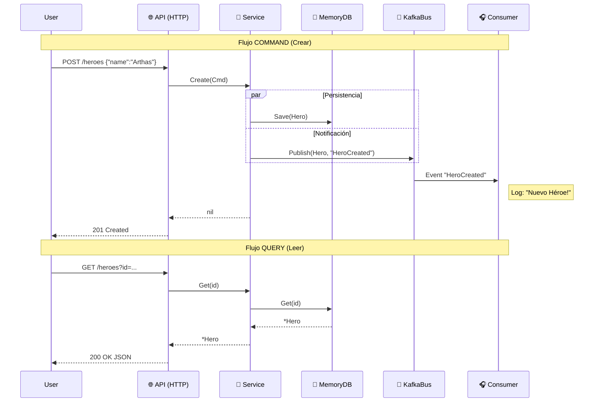

# 05 - Ciclo Completo y Patrones SOLID

Hemos llegado al final de nuestra implementación "Core".
En esta sección conectamos **todos** los puntos y aplicamos el patrón **CQS (Command Query Separation)**.

## 1. El Ciclo de Vida (Full Cycle)

Ahora nuestro sistema soporta dos flujos principales:
1.  **Command (Escribir)**: `POST /heroes` -> Crea, Persiste y Notifica.
2.  **Query (Leer)**: `GET /heroes?id=...` -> Consulta el estado actual.



## 2. Refactorización y Estructura

Para mantener el código limpio y profesional, hemos dividido el Servicio (`herosrv`) en archivos según su responsabilidad (Vertical Slicing dentro del componente):

-   `service.go`: Definición de Dependencias (`struct`) y Factory (`New`).
-   `create.go`: Lógica de Escritura (**Command**).
-   `get.go`: Lógica de Lectura (**Query**).

## 3. SOLID aplicado al Microservicio

Durante todo el tutorial hemos aplicado patrones SOLID casi sin darnos cuenta. Aquí están explicados en nuestro código:

| Letra | Principio | Dónde se aplica | Explicación |
| :--- | :--- | :--- | :--- |
| **S** | **SRP** (Responsabilidad Única) | `create.go` vs `get.go` | Hemos separado la lógica de CREAR de la de LEER en archivos distintos. Cada archivo tiene una única razón para cambiar. |
| **O** | **OCP** (Abierto/Cerrado) | `EventBus` | Agregamos Kafka SIN tocar el Dominio. Podríamos agregar RabbitMQ haciendo otra implementación sin romper el `Service`. |
| **L** | **LSP** (Sustitución de Liskov) | `MemoryRepo` | `MemoryRepo` cumple con `ports.HeroRepository` igual que lo haría un `PostgresRepo`. El Servicio no sabe la diferencia. |
### Integración con Plataforma (Infraestructura)

Este microservicio es "Cloud Agnostic" pero depende de que exista una infraestructura de mensajería.
Usaremos **Platform Kafka Admin** para proveer esa infra.

1.  **Levantar Plataforma** (si no está corriendo): `docker-compose up -d` en `projects/platform-kafka-admin`.
2.  **Provisionar Recurso (Topic)**:
    ```bash
    # Pedimos a la plataforma que nos de un canal de comunicación
    curl -X POST -d '{"name":"hero-events-05"}' http://localhost:3000/topics
    ```
3.  **Ejecutar Servicio**:
    Nuestro código se conectará automáticamente al puerto `9094` (definido por la plataforma).
 | El Servicio PIDE sus dependencias (interfaces), no las crea ("new Kafka()"). El `main.go` se las inyecta. |

## 4. Conclusión

Has construido un sistema:
1.  **Desacoplado**: Cambiar Kafka por RabbitMQ es trivial.
2.  **Testable**: Puedes mockear `ports.HeroRepository`.
3.  **Escalable**: El Consumer puede correr en 10 instancias distintas.
4.  **Organizado**: Con CQS y SOLID, el código es fácil de navegar.

¡Felicidades! Tienes una arquitectura profesional en Go.
