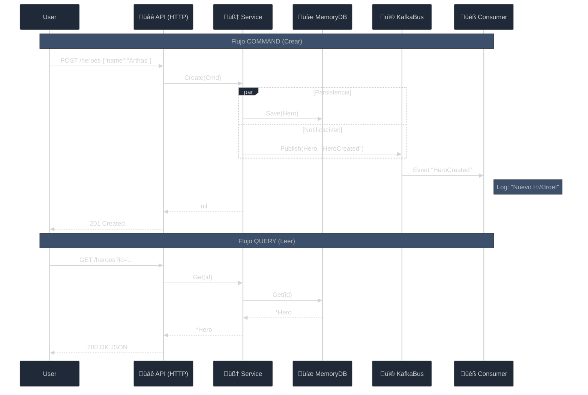

# 05 - Ciclo Completo y Patrones SOLID

Hemos llegado al final de nuestra implementación "Core".
En esta sección conectamos **todos** los puntos y aplicamos el patrón **CQS (Command Query Separation)**.

## 1. El Ciclo de Vida (Full Cycle)

Ahora nuestro sistema soporta dos flujos principales:
1.  **Command (Escribir)**: `POST /heroes` -> Crea, Persiste y Notifica.
2.  **Query (Leer)**: `GET /heroes?id=...` -> Consulta el estado actual.


```mermaid
%%{
  init: {
    'theme': 'dark',
    'themeVariables': {
      'primaryColor': '#1f2937',
      'edgeLabelBackground':'#1f2937',
      'tertiaryColor': '#111827',
      'mainBkg': '#1f2937',
      'nodeBorder': '#8b5cf6',
      'lineColor': '#3b82f6',
      'textColor': '#f3f4f6'
    }
  }
}%%
sequenceDiagram
    participant User
    participant API as üåê API (HTTP)
    participant Srv as 🧠 Service
    participant DB as üíæ MemoryDB
    participant Bus as üì® KafkaBus
    participant Worker as üéß Consumer

    Note over User, Worker: Flujo COMMAND (Crear)
    User->>API: POST /heroes {"name":"Arthas"}
    API->>Srv: Create(Cmd)
    
    par Persistencia
        Srv->>DB: Save(Hero)
    and Notificación
        Srv->>Bus: Publish(Hero, "HeroCreated")
    end
    
    Bus->>Worker: Event "HeroCreated"
    Note right of Worker: Log: "Nuevo Héroe!"
    
    Srv-->>API: nil
    API-->>User: 201 Created

    Note over User, Worker: Flujo QUERY (Leer)
    User->>API: GET /heroes?id=...
    API->>Srv: Get(id)
    Srv->>DB: Get(id)
    DB-->>Srv: *Hero
    Srv-->>API: *Hero
    API-->>User: 200 OK JSON
```

## 2. Refactorización y Estructura

Para mantener el código limpio y profesional, hemos dividido el Servicio (`herosrv`) en archivos según su responsabilidad (Vertical Slicing dentro del componente):

-   `service.go`: Definición de Dependencias (`struct`) y Factory (`New`).
-   `create.go`: Lógica de Escritura (**Command**).
-   `get.go`: Lógica de Lectura (**Query**).

## 3. SOLID aplicado al Microservicio

Durante todo el tutorial hemos aplicado patrones SOLID casi sin darnos cuenta. Aquí están explicados en nuestro código:

| Letra | Principio | Dónde se aplica | Explicación |
| :--- | :--- | :--- | :--- |
| **S** | **SRP** (Responsabilidad Única) | `create.go` vs `get.go` | Hemos separado la lógica de CREAR de la de LEER en archivos distintos. Cada archivo tiene una única razón para cambiar. |
| **O** | **OCP** (Abierto/Cerrado) | `EventBus` | Agregamos Kafka SIN tocar el Dominio. Podríamos agregar RabbitMQ haciendo otra implementación sin romper el `Service`. |
| **L** | **LSP** (Sustitución de Liskov) | `MemoryRepo` | `MemoryRepo` cumple con `ports.HeroRepository` igual que lo haría un `PostgresRepo`. El Servicio no sabe la diferencia. |
### Integración con Plataforma (Infraestructura)

Este microservicio es "Cloud Agnostic" pero depende de que exista una infraestructura de mensajería.
Usaremos **Platform Kafka Admin** para proveer esa infra.

1.  **Levantar Plataforma** (si no est√° corriendo): `docker-compose up -d` en `projects/platform-kafka-admin`.
2.  **Provisionar Recurso (Topic)**:
    ```bash
    # Pedimos a la plataforma que nos de un canal de comunicación
    curl -X POST -d '{"name":"hero-events-05"}' http://localhost:3000/topics
    ```
3.  **Ejecutar Servicio**:
    Nuestro código se conectará automáticamente al puerto `9094` (definido por la plataforma).
    ```bash
    make run-api
    ```

### üß™ Probando el Sistema Completo

**1. Crear un Héroe (Command)**:
```bash
curl -X POST -d '{"id":"h-100", "name":"Sylvanas", "role":"Ranger"}' http://localhost:8081/heroes
```
*   Deberías ver un `201 Created`.
*   En el log del Consumer: `‚úÖ EVENTO RECIBIDO: HeroCreated`.

**2. Consultar el Héroe (Query)**:
```bash
curl "http://localhost:8081/heroes?id=h-100"
```
*   Respuesta: `{"id":"h-100","name":"Sylvanas","role":"Ranger",...}`

## 4. Conclusión

Has construido un sistema:
1.  **Desacoplado**: Cambiar Kafka por RabbitMQ es trivial.
2.  **Testable**: Puedes mockear `ports.HeroRepository`.
3.  **Escalable**: El Consumer puede correr en 10 instancias distintas.
4.  **Organizado**: Con CQS y SOLID, el código es fácil de navegar.

¬°Felicidades! Tienes una arquitectura profesional en Go.
