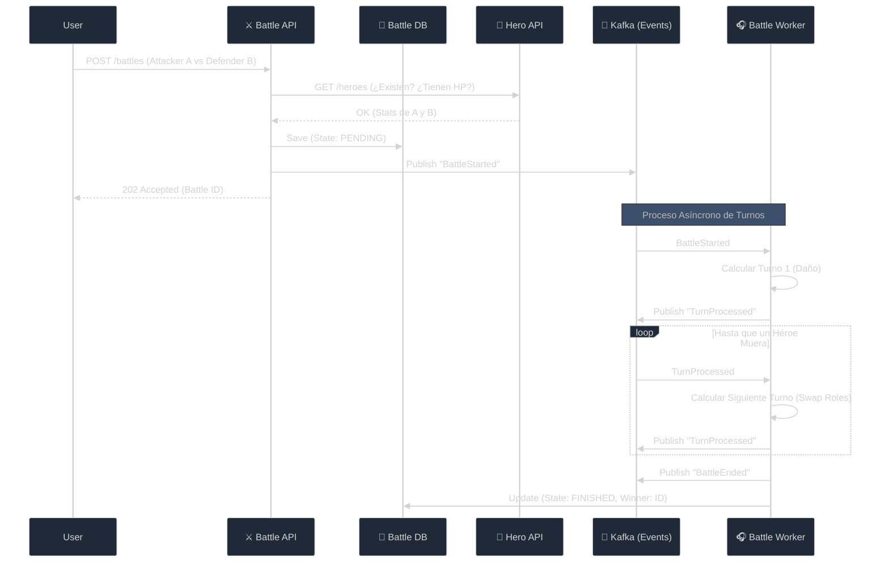

# 06 - Sistema de Batalla: Microservicios y Estado Asíncrono

En esta sección, elevamos la complejidad. Ya no solo gestionamos datos (CRUD), sino que orquestamos una **Lógica de Negocio Asíncrona** distribuida entre microservicios.

## 1. El Desafío: ¿Cómo pelean dos Microservicios?

En un RPG, una batalla no es instantánea. Hay turnos, cálculos de daño y cambios de estado. 
Nuestro `Battle System` (`projects/section-06-battle-system`) es un servicio independiente que necesita datos de otro servicio (`Hero Service`).

### Arquitectura de Integración



---

## 2. Decisiones de Diseño (SOLID & Patterns)

### A. Comunicación entre Servicios (Client Port)
Para saber los stats de los héroes, el Battle System usa un `HeroClient`. 
- **Patrón**: Adaptador de salida (Rest Client).
- **SOLID (DIP)**: El servicio depende de la interfaz `HeroClient`, no de la URL de la API.

### B. El Bucle de Batalla (Event-Driven)
En lugar de un `for` gigante que bloquee el hilo, cada turno es un evento.
1. `BattleStarted` inicia el primer turno.
2. Cada `TurnProcessed` dispara el siguiente.
- **Ventaja**: El sistema puede procesar miles de batallas en paralelo sin saturar la memoria.

### C. Estado de la Batalla
Una batalla tiene un ciclo de vida:
`PENDING` -> `IN_PROGRESS` -> `FINISHED`

---

## 3. Guía de Uso del Servicio

### Configuración de Ambiente
El servicio necesita saber dónde está Kafka y dónde está el Hero Service.

```bash
# .env del Battle System
BATTLE_PORT=:8082
KAFKA_BROKER=127.0.0.1:9094
HERO_SERVICE_URL=http://localhost:8081
```

### Endpoints Principales

#### 1. Iniciar Batalla (CREATE)
```bash
curl -X POST -d '{
  "attacker_id": "uuid-hero-1",
  "defender_id": "uuid-hero-2"
}' http://localhost:8082/battles
```

#### 2. Consultar Estado (GET)
```bash
curl http://localhost:8082/battles/{id}
```

---

## 4. Tipos de Eventos (Topic: `battle-events`)

-   **BattleStarted**: Registra el inicio y los contendientes.
-   **TurnProcessed**: Detalles de cada golpe (quién pegó, cuánto daño, cuánta vida queda).
-   **BattleEnded**: Resultado final y ganador.
-   **BattleStartFailed**: Si los héroes no existen o no pueden pelear.

---
## 5. Próximos Pasos en el Tutorial

En las siguientes secciones implementaremos:
1. Persistencia real en base de datos.
2. Sistema de críticas y esquivas.
3. Notificaciones en tiempo real vía WebSockets.
