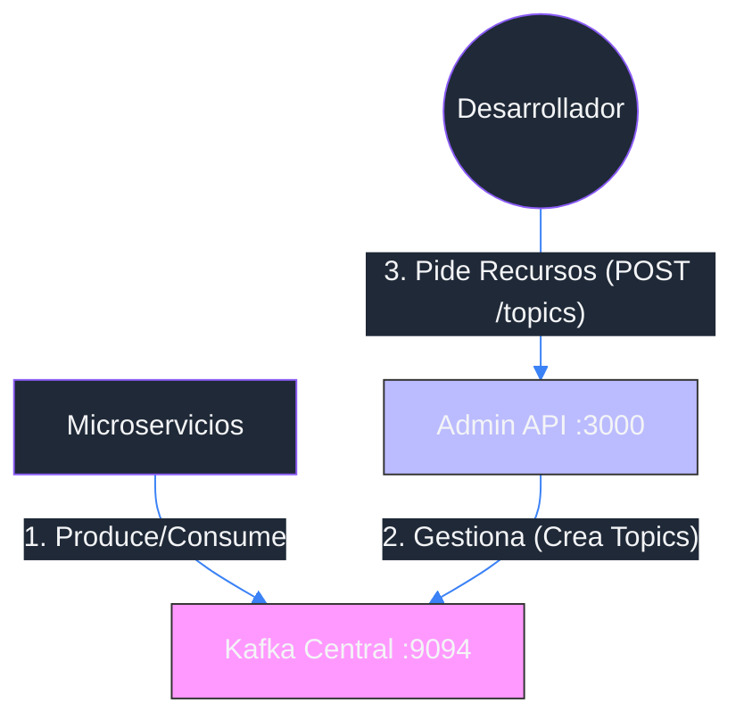

# 06 - Plataforma Central: Gestión de Kafka (Guía de Experto)

Hasta ahora, cada microservicio levantaba su propio servidor de Kafka. Esto funciona para aprender, pero en el mundo real es **insostenible**.

Imagina que Kafka es el "Sistema Postal" de tu ciudad.
No construyes una Oficina de Correos nueva cada vez que abres un negocio.
Utilizas la **Oficina Central** que ya existe.

Hemos creado el proyecto `projects/platform-kafka-admin` para que sea esa "Oficina Central".

## 1. Arquitectura Centralizada



-   **Admin API**: Es tu panel de control. El único lugar autorizado para crear "buzones" (Topics).
-   **Services**: Solo saben *usar* los buzones, no fabricarlos.

## 2. Kafka 101: ¿Qué estoy configurando?

Cuando usas nuestra API para crear un topic, te pedimos 3 cosas: `name`, `partitions`, y `replicas`.
Como experto en Kafka, déjame explicarte qué significan con analogías simples.

### A. Topic (El Buzón)
Es la categoría del mensaje. Ejemplo: `hero-created` o `enemy-spotted`.

### B. Partitions (Las Ventanillas)
Imagina un banco.
-   **1 Partición** = 1 Ventanilla única. Todos hacen una fila india.
    -   *Ventaja*: Orden garantizado (el cliente 2 siempre es atendido después del 1).
    -   *Desventaja*: Lento si hay 1 millón de clientes.
-   **10 Particiones** = 10 Ventanillas.
    -   *Ventaja*: Mucho más rápido (paralelismo).
    -   *Desventaja*: Pierdes el orden global (la ventanilla 3 puede ir más rápido que la 1).

> **Recomendación Inicial**: Para nuestros Héroes, usa **1 Partición**. Queremos asegurar que la "Creación" ocurra antes que la "Muerte".

### C. Replicas (Las Copias de Seguridad)
-   **Factor 1**: El mensaje está en un solo servidor. Si ese servidor explota, adiós mensaje.
-   **Factor 3**: El mensaje se copia en 3 servidores distintos.

> **Recomendación Inicial**: Como estamos en local (un solo nodo de Kafka), usa **1 Réplica**. No puedes tener 3 copias si solo tienes 1 disco duro.

## 3. ¿Cómo usar la Platform Admin?

### Paso 1: Levantar la Infraestructura
Ve al proyecto de plataforma y enciéndelo. Este es el único `docker-compose up` que necesitarás de ahora en adelante.

```bash
cd projects/platform-kafka-admin
docker-compose up -d
go run cmd/admin-api/main.go
# 🚀 Kafka Admin API starting on :3000
```

### Paso 2: Crear un Topic "Resource"
Supongamos que vas a crear el servicio de "Inventario" mañana. Necesitas un topic.

**Request (Crear)**:
```bash
curl -X POST -d '{"name":"inventory-updates", "partitions":1, "replicas":1}' http://localhost:3000/topics
```

**Respuesta**:
```json
{
    "message": "topic created",
    "topic": { ... }
}
```

```bash
curl http://localhost:3000/topics
# ["hero-events-05", "inventory-updates"]
```

## 4. Administración Profesional (Retention & Cleanup)

En producción, no puedes dejar que los topics crezcan infinitamente (te quedarás sin disco).
Nuestra API ha evolucionado para permitir configuraciones avanzadas.

### A. Política de Retención (Retention)
¿Cuánto tiempo viven los mensajes?
-   **Default**: 7 días (normalmente).
-   **Nuestra API**: Puedes especificarlo en milisegundos (`retention.ms`).

**Ejemplo: Topic de Logs (Borrar cada 24hs)**
```bash
curl -X POST http://localhost:3000/topics \
  -H 'Content-Type: application/json' \
  -d '{
    "name": "system-logs",
    "partitions": 2,
    "replicas": 1,
    "config": {
        "retention.ms": "86400000"
    }
}'
```

### B. Compactación (Log Compaction)
Para topics que guardan el "último estado" (ej: Inventario de un Jugador), no nos interesa el historial, solo el valor final.
-   **cleanup.policy**: `delete` (borrar por tiempo) vs `compact` (borrar antiguos si hay uno nuevo con la misma Key).

**Ejemplo: Topic de Estado de Jugador (Compactado)**
```bash
curl -X POST http://localhost:3000/topics \
  -H 'Content-Type: application/json' \
  -d '{
    "name": "player-states",
    "partitions": 1,
    "replicas": 1,
    "config": {
        "cleanup.policy": "compact",
        "min.cleanable.dirty.ratio": "0.01"
    }
}'
```

> **Nota**: `compact` requiere que tus mensajes siempre tengan **Key** ( userID, itemID, etc).

## 5. Panel Visual (Kafka UI)

No te gusta la terminal? No hay problema.
Hemos incluido **Kafka UI** en la plataforma.

1.  Abre tu navegador en: [http://localhost:8080](http://localhost:8080)
2.  Verás el dashboard con:
    *   **Brokers**: Estado de tus servidores (Debes ver 1 Online).
    *   **Topics**: Lista de todos los buzones creados.
    *   **Consumers**: Quién está leyendo mensajes ahora mismo.


*(Imagen referencial)*

Usa este panel para depurar visualmente si tus mensajes están llegando.

## 6. Conclusión

Has graduado tu arquitectura.
-   **Antes**: Caos. Cada servicio decidía sobre la infraestructura.
-   **Ahora**: Orden. La Plataforma provee recursos, los Servicios consumen recursos.

Este modelo es el estándar en empresas maduras (Platform Engineering). ¡Bien hecho!
