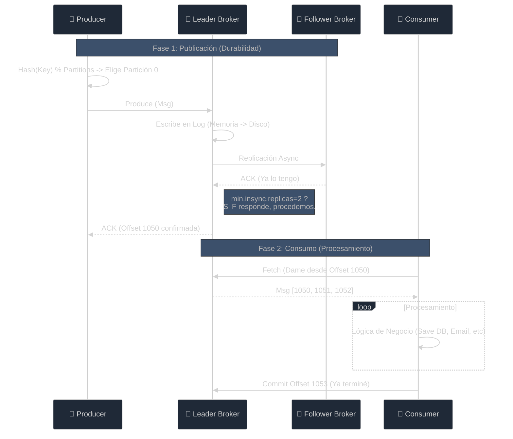

# 07 - Kafka en Producción: La Guía Definitiva de Operaciones

> **Rol:** Principal Platform Engineer.
> **Objetivo:** No darte "tips", sino explicarte cómo no destruir la producción a las 3 AM.

Has creado topics y enviado mensajes. Eso es fácil.
Operar Kafka en un entorno donde se mueven millones de dólares o datos críticos es otra historia.
Aquí termina la magia y empieza la ingeniería.

---

## 1. Creación de Topics: Parámetros Exhaustivos

Cuando haces `POST /topics`, estás definiendo el contrato de rendimiento y durabilidad. Un error aquí es costoso de corregir.

### Parámetros Críticos (Must Know)

| Parámetro | Qué controla | Problema que resuelve | Recomendación Prod |
| :--- | :--- | :--- | :--- |
| `name` | Identificador único. | Organización (Namespacing). | Usa prefijos: `domain.entity.event`. Ej: `billing.invoice.created`. |
| `partitions` | Paralelismo. | Velocidad de consumo. | **3 a 6** para empezar. Difícil de cambiar sin romper orden. |
| `replication.factor` | Durabilidad. | ¿Cuántos servers pueden morir? | **3**. (Permite que caiga 1 sin detener el cluster, o 2 con riesgo). |
| `min.insync.replicas` | Garantía de Escritura. | Evita perder datos si el líder acepta pero no replica. | **2**. Obliga a que al menos 2 copias existan antes de decir "OK". |
| `cleanup.policy` | Ciclo de vida. | Disco lleno vs Historial infinito. | `delete` (logs/eventos) o `compact` (tablas de estado). |

### Parámetros Avanzados (Fine Tuning)

| Parámetro | Qué controla | Impacto Operativo |
| :--- | :--- | :--- |
| `retention.ms` | Tiempo de vida. | Si pones `-1` (infinito) sin monitoreo, llenarás el disco y tirarás el cluster. Default: 7 días (`604800000`). |
| `retention.bytes` | Tamaño máximo del topic. | "Guarda máximo 100GB". Útil para limitar costos de almacenamiento cloud. |
| `segment.bytes` | Tamaño de archivo de log. | Kafka escribe en archivos (`.log`). Si es muy pequeño, muchos archivos abiertos. Si es muy grande, difícil de limpiar. Default: 1GB. |
| `compression.type` | Algoritmo (gzip, snappy, lz4). | CPU vs Ancho de Banda. `producer` (lo que mande el cliente) o `lz4` (balanceado) es lo mejor. |
| `max.message.bytes` | Tamaño máximo de 1 mensaje. | Default 1MB. **¡Cuidado!** Si subes esto, debes subirlo en Brokers y Consumers también o todo fallará. |
| `unclean.leader.election.enable` | Disponibilidad vs Consistencia. | Si el líder muere y solo queda una réplica desactualizada... ¿la elegimos? `true` = pierdes datos pero sigues online. `false` (default) = te detienes para proteger datos. |

---

## 2. Viaje de un Evento: De Producer a Consumer

Kafka no es "fuego y olvido". Es un compromiso distribuido.

### Verdades Incómodas
1.  **ACKs**: Si configuras `acks=0` (Producer), Kafka no te promete nada. Si `acks=all`, esperará a las réplicas (`min.insync.replicas`). **Usa `acks=all` en producción**.
2.  **Orden**: Solo existe DENTRO de una partición. Entre particiones no hay orden global.
3.  **Duplicados**: Si el Producer envía, el Broker guarda, pero el ACK de vuelta falla (red), el Producer reintentará. **Resultado: Mensaje duplicado en Kafka**. Tu consumidor debe ser **Idempotente**.

---

## 3. Consumers y Consumer Groups (Sin Mitos)

Esta es la fuente #1 de confusión.

### ¿Un topic puede tener múltiples consumers?
**SÍ**.
- Si tienen **diferente `GroupID`**: Es **Fan-Out** (Pub/Sub). Todos reciben copia de todo. (Ej: Servicio de Facturación y Servicio de Analytics escuchando `ventas`).
- Si tienen **mismo `GroupID`**: Es **Load Balancing** (Queue). Se reparten el trabajo.

### La Magia del Rebalanceo
Imagina un Topic con **4 Particiones** y un Consumer Group "Heroes".

1.  **Levantas Consumer A**: Kafka le asigna [0, 1, 2, 3]. (Trabaja duro).
2.  **Levantas Consumer B**: Kafka detecta al nuevo. Pausa a A ("Stop the world"). Reasigna: A=[0,1], B=[2,3].
3.  **Consumer A muere (OOM)**: Kafka espera `session.timeout.ms`. Declara a A muerto. Reasigna [0,1,2,3] a B.

**Peligro**: Si tu procesamiento tarda más que `max.poll.interval.ms`, Kafka creerá que moriste y te quitará las particiones. ¡Entrarás en un loop de rebalanceos infinitos!

---

## 4. ¿Qué pasa con un mensaje? (Semántica de Entrega)

### Escenario A: "Happy Path" (At-Least-Once)
1.  Consumer lee mensaje Offset 5.
2.  Procesa ok.
3.  Hace Commit Offset 6.
**Resultado**: Perfecto.

### Escenario B: Consumer muere procesando
1.  Consumer lee mensaje Offset 5.
2.  Procesa a medias (o termina pero muere antes del commit).
3.  Nuevo Consumer toma la partición. Kafka le dice "El último commit fue 5".
4.  Nuevo Consumer lee Offset 5 **de nuevo**.
**Resultado**: **Mensaje Duplicado**. Tu código debe manejar esto (Upsert en DB, dedup por ID).

### Escenario C: Auto-Commit prematuro (At-Most-Once - PELIGROSO)
1.  Consumer lee.
2.  Kafka librería hace Auto-Commit en background.
3.  Consumer crashea procesando.
**Resultado**: **Mensaje Perdido**. Kafka cree que ya lo procesaste.
**Recomendación**: Desactiva `enable.auto.commit` si tu lógica es crítica. Haz commit manual al final.

---

## 5. Manejo de Errores en Producción

¿Qué haces si llega un mensaje "malformado" que hace crashear tu consumer?

### ❌ Lo que NO debes hacer
- Poner un `for { retry }` infinito. Bloquearás toda la partición. Nadie más procesará nada detrás de ese mensaje.

### ✅ Estrategia Ganadora: Dead Letter Queue (DLQ)
1.  Intenta procesar `try...catch`.
2.  Si falla (y no es transitorio como DB down), **no reintentes infinitamente**.
3.  Publica ese mensaje fallido en otro topic: `hero-events-dlq`.
4.  Haz Commit del original y sigue con el siguiente.
5.  Alerta a un humano para revisar la DLQ.

---

## 6. Checklist Final para Producción

No despliegues a Prod sin responder esto:

1.  [ ] **Retention**: ¿Está configurada? ¿Tengo disco para soportar `retention.bytes` si el tráfico se duplica?
2.  **Particiones**: ¿Puse suficientes? (Aumentarlas luego rompe la garantía de llave/orden). Empieza con 3 o 6.
3.  **Clave (Key)**: ¿Estoy usando una Key con buena cardinalidad (UserID)? ¿O estoy mandando `null` y perdiendo orden?
4.  **Replicación**: ¿Es al menos 3? ¿`min.insync.replicas` es 2?
5.  **Idempotencia**: ¿Qué pasa si proceso el mismo JSON dos veces? ¿Mi DB explota o hace update? (Debe hacer update).
6.  **Alertas**: ¿Tengo alerta si el "Consumer Lag" (retraso) sube de 1000 mensajes?

---
*Bienvenido a la ingeniería de sistemas distribuidos. Kafka es una bestia poderosa, trátala con respeto.*
