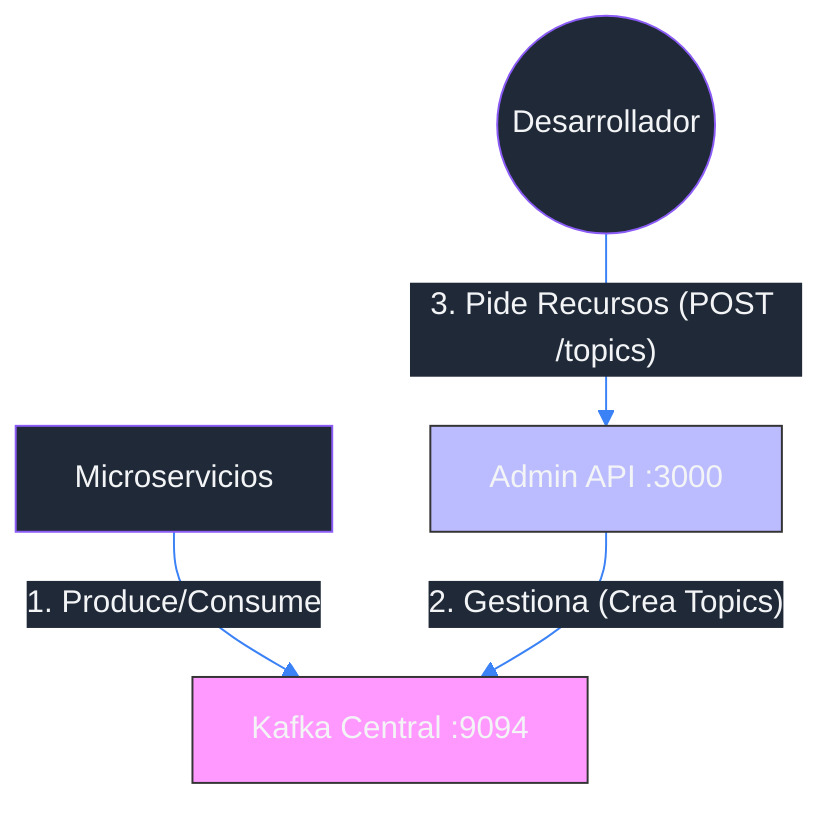
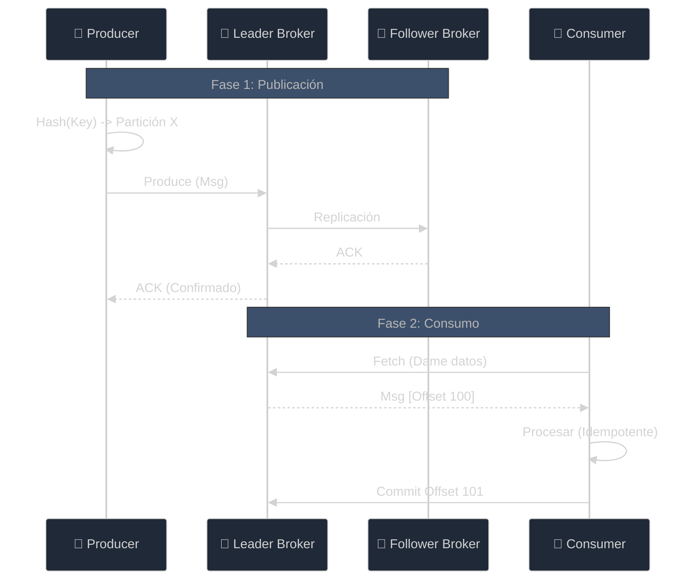

# Guía de Plataforma: Administración y Operación de Kafka

Esta guía consolida todo el conocimiento necesario para gestionar la infraestructura de Kafka en nuestro ecosistema, desde la creación de topics hasta la operación en producción y el flujo detallado de mensajes.

---

## 1. Arquitectura Centralizada (Platform Admin)

Hasta ahora, cada microservicio levantaba su propio servidor de Kafka. En el mundo real, utilizamos una **Oficina Central**. El proyecto `projects/platform-kafka-admin` actúa como esa oficina.

### Arquitectura de la Plataforma

- **Admin API**: Único lugar autorizado para gestionar Topics.
- **Kafka Central**: El broker que sirve a todos los servicios.
- **Kafka UI**: Panel visual en [http://localhost:8080](http://localhost:8080).

---

## 2. Kafka 101: Conceptos de Configuración

Cuando creas un topic, configuras tres pilares fundamentales:

### A. Partitions (Paralelismo)
- **1 Partición**: Orden garantizado, pero procesamiento secuencial (1 ventanilla).
- **Múltiples Particiones**: Procesamiento en paralelo, pero el orden global se pierde (solo se garantiza por **Key**).
- **Recomendación**: Empezar con 1 para flujos de estado (Héroes) o 3-6 para alto volumen.

### B. Replicas (Durabilidad)
- **Factor 1**: Sin copia de seguridad (solo desarrollo).
- **Factor 3**: Estándar de producción. Tolera la caída de un servidor sin pérdida de datos.
- **min.insync.replicas**: Configúralo en **2** para asegurar que el mensaje se guarde en al menos dos sitios antes de confirmar éxito.

### C. Retention & Cleanup
- **retention.ms**: Tiempo de vida del mensaje (Default 7 días).
- **cleanup.policy**: 
    - `delete`: Borra mensajes antiguos.
    - `compact`: Mantiene solo el último valor por cada clave (ideal para tablas de estado).

---

## 3. Guía de Operaciones en Producción

Operar Kafka requiere precisión técnica para evitar pérdida de datos o degradación de rendimiento.

### Parámetros Críticos

| Parámetro | Recomendación Prod | Razón |
| :--- | :--- | :--- |
| `acks` | `all` | Máxima durabilidad. Espera confirmación de todas las réplicas. |
| `compression.type` | `lz4` | Balance óptimo entre CPU y uso de red. |
| `enable.auto.commit` | `false` | Control manual de offsets para evitar pérdida de mensajes en crasheos. |

### El Viaje de un Evento

---

## 4. Anatomía del Mensaje y Flujo Experto

### Anatomía del Mensaje
1. **Topic**: El buzón destino.
2. **Key**: Crucial para el orden. Los mensajes con la misma Key siempre van a la misma partición. **Usa `hero.ID` como Key**.
3. **Value (Payload)**: JSON con `event_type`, `occurred_at` y `data`.
4. **Headers**: Metadatos para trazabilidad (IDs de correlación).

### Idempotencia y Resiliencia
- **Duplicados**: Son inevitables en sistemas distribuidos. Tu consumidor debe usar `UPSERT` o `ON CONFLICT` en la base de datos.
- **Dead Letter Queue (DLQ)**: Si un mensaje falla repetidamente, no bloquees la partición. Envíalo a un topic de error (`-dlq`) y sigue procesando.

---

## 5. Checklist de Puesta en Marcha

1. [ ] ¿`min.insync.replicas` es >= 2?
2. [ ] ¿El consumidor es idempotente (maneja duplicados)?
3. [ ] ¿Tengo un topic `-dlq` configurado?
4. [ ] ¿Estoy enviando Key en los mensajes que requieren orden?
5. [ ] ¿Tengo monitoreo sobre el **Consumer Lag**?

---
*Esta guía centralizada reemplaza los tutoriales individuales 06, 07 y 08 para ofrecer una visión holística de la plataforma.*
